# Rock Paper Scissors Simulator

A simulation about the game 'Rock Paper Scissors'.
You can bet with your friends who will win the eternal battle between those 3 objects !
Or you can use this program as a real agent-based modeling and personalize your simulation.

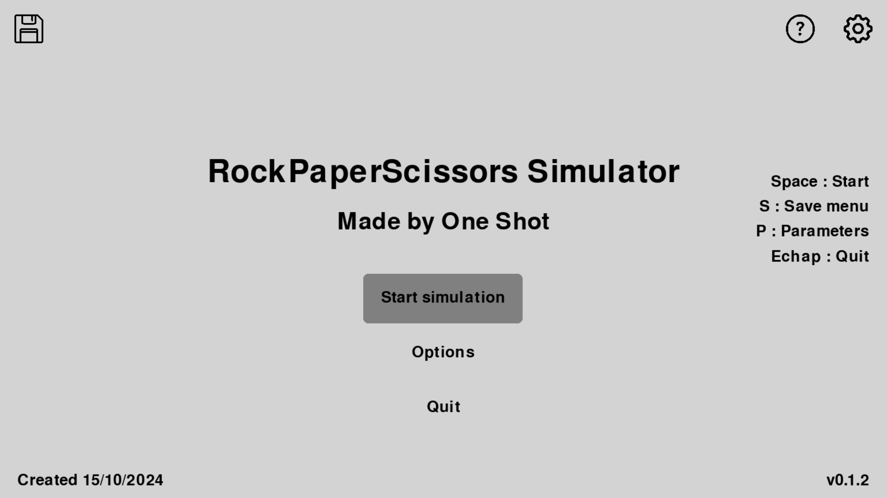

***
## Vocabulary : 
- Simulation : A simulated environment with entities that can interact with it, with other entities or with themselves (mutation).
  In this case, there is no environment but the entities can 
- Entity : A thing that can move and interact with its environment or its peers.
- Type of entity : Group with distinct attributes and/or appearance. Can be compared to a specie.
- Mutation : An event that occurs randomly to modify an entity's attribute (speed, range, size, etc).
- Turn : An amount of time that has past.
- Target : The types of entity an entity will search, pursue and beat if caught.
- Predator : The types of entity an entity will be beaten by if catch and flee if is smart.
- Beat an entity : Transform it into its own type.

***
## Rules : 
- Entities can beat other entities and be beaten respecting the following schema :
  Rock < Paper < Scissors < Rock\
- Sheldon rules : \
  Rock < Paper < Scissors < Spock < Lizard < Rock\
  Rock < Spock < Paper < Lizard < Scissors < Rock
- Entities will automatically go to the closest target.
- If the entity is smart and no target remains, it will flee its nearest predator. Else, it will randomly move.

***
## Prerequisites :

- Python 3.11.1 or below
- Python interpreter
- Librairies :
    - datetime : Use to get current date and datetime.
    - json : Use to save data from the simulations as json files and load files.
    - math : Use to make mathematical operations (like using infinite and square root function).
    - matplotlib : Use to create and display graphics using simulations' data.
    - numpy : Use to create and manipulate set of numbers.
    - os : Use to access files and create directories and files.
    - pathlib : Use to check if a path exists.
    - PIL : Use to manage gif files (in saves menu - simulation tab).
    - pygame : Use to manage the whole program interface.
    - re : Use to search specific name in saves.
    - shutil : Use to get rights to delete saves (only use in program).
    - statistics : Use to make data more readable to create graphics.
    - webcolors : Use to transform color names into rgb values.

***
## Installation guide

On GitHub : 
- Click on the green "<> Code" button
- On Local/SSH/, click on "Download as zip"
- Choose a location for the program in your machine\
On your computer : 
- Unzip the files
- With your python interpreter, launch the file "main.py"
- The simulations can start !

***
## User guide

#### Methods

Main menu : 
- [SPACE]   "Start simulation/Start" : Launch a new simulation (random placement of entities).
- [S]       "Save menu" (floppy disk icon) : Open the saves menu.
- [H]       "Hide/Show UI" : Will hide or show interfaces.
- [I]       "Informations" (question mark icon) : Open the help note menu.
- [P]       "Options/Parameters" (toothed wheel icon) : Open the settings menu.
  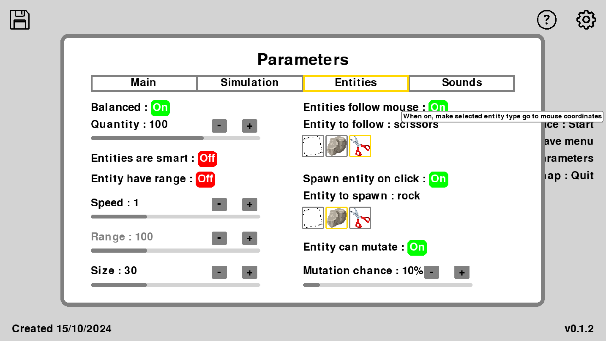
- [C]       "Credits" : Open the credit menu. Can be closed by clicking or pressing any key.

Simulation : 
- [H]       "Hide/Show UI" (parameter) : Will hide or show interfaces.
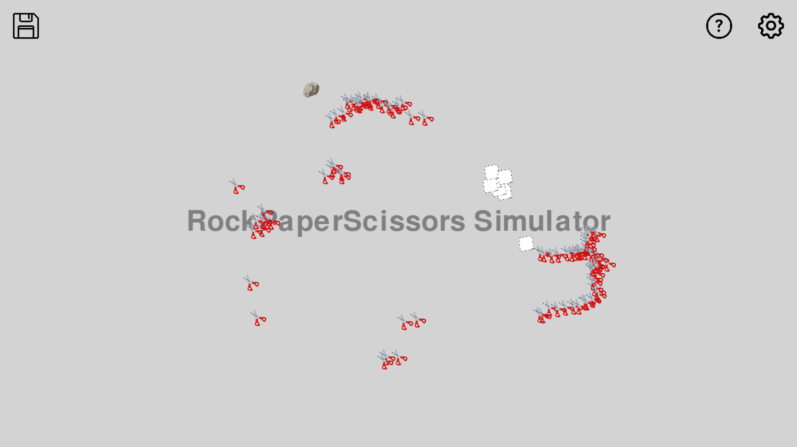
- [R]       "Restart" : Will launch another simulation.
- [SPACE]   "Pause" : Pause simulation and show the pause screen. 
- [S]       "Save menu" (floppy disk icon) : Open the saves menu.
- [P]       "Parameters" (toothed wheel icon) : Open the settings menu.
- [C]       "Credits" : Open the credit menu. Can be closed by clicking or pressing any key.
- [I]       "Help note" (question mark icon) : Open the help note menu.
- [Q]       "Return to menu" (options) : Stop the program. Can auto-save the ongoing simulation if the parameter is active.
- .         Entity data (mouse on entity) : Display a screen with all entity data and purpose.

[ECHAP] shortcut has been removed since v0.1.4 !

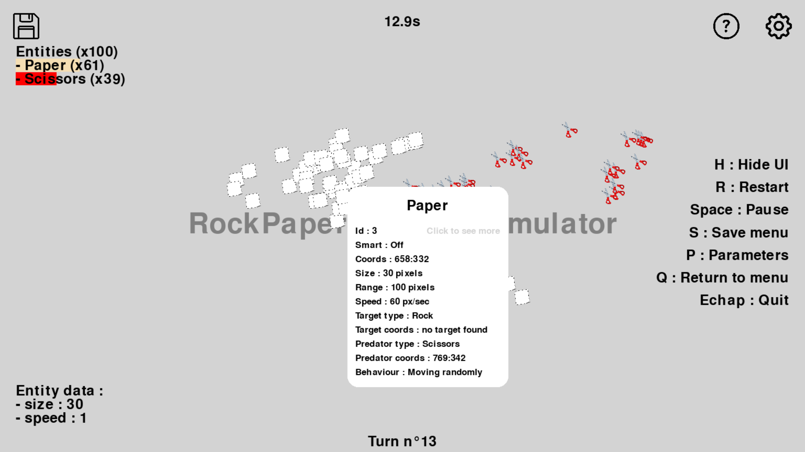

Pause : 
- "Resume" : Resume the simulation.
- "Options" : Open the settings menu.
- "Menu" : Go back to menu (may show a warning screen before doing so).

Settings menu : click on the tabs to open them
- "Main" : Open the main tab.
    - Fullscreen : [In production] When on, change the program to fullscreen size. \
      When off, change it to half the size.
    - Gamma : Change the gamma (brightness) of the screen.
    - "Developer settings" button : Will change some parameters to adapt to my tastes. \
      Feel free to try them.
    - "Update simulation" button : Will reload the current simulation data. \ 
      Click in case of a problem.
    - "Credits" button : Play credits. Speed can be changed with up/down arrows.

- "Simulation" : Open the simulation tab.
    - "Display number of turns" : When on, will display the number of current turns in the simulation on the bottom middle of the screen.
        - "Turn pause" : Will go to the next turn every X second(s). If set to 0, will change every time the program loop.
          Between 0 and 10.
    - "Entities stay on screen" : When on, entities can't leave the screen (get stuck at the borders). When off, the map is infinite.
      Incompatible with "Screen is toroidal".
    - "Screen is toroidal" : When on, entities will go from one side to the other if it goes through one entirely.
      Ex: If it goes too far to the left, will appear to the right of the screen. Same for top and bottom.
      Incompatible with "Entities stay on screen".
    - "Quantity is on percent" : When on, will show the amount of each type of entity in percent. When off, show it in number.
    - "Sheldon version" : Use Sheldon version of RPS (with Lizard & Spock).
    - "UI is on front" : When on, display the interface above entities. When off, display it behind.
    - "UI is hide" : When on, won't show the interface.
    - "Auto end" : When on, simulation will close if only one type of entity remains. Will display a message when it's the case.
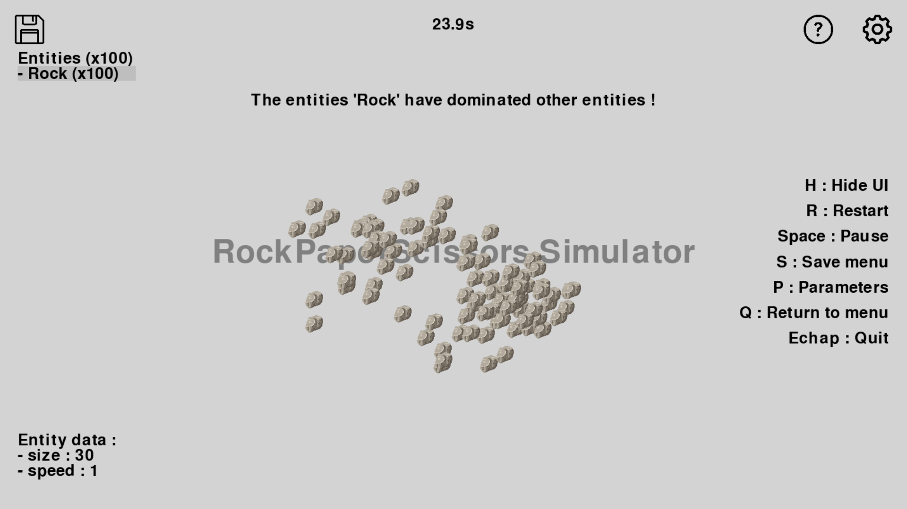
    - "Auto play" : When on, on the saves menu on the simulation tab, will show each image of each turn for a second each (play as a gif).
    - "Auto save" : [In production] When on, will automatically save the current simulation when going back to the main menu.

- "Entities" : Open the entity tab.
    - "Balanced" : When on, will create the same amount of entity of each type. When off, entities will be randomly created.
    - "Quantity" : Can choose the number of entities created at the start of the simulation. Between 0 and 150.
    - "Entities are smart" : When on, if an entity doesn't have a target, it will flee their closest predator.
    - "Entity have range" : When on, entity will only be able to see their environnement inside a circle around them (range).
      When off, entities' range is infinite.
    - "Speed" : Speed of the entities. Between 0 and 3.
    - "Range" : Range of the entities. Between 0 and 300.
    - "Size" : Size of the entities. Between 1 and 90.
    - "Entity follow mouse" : When on, selected entities will go to the mouse coordinates.
        - "Entity to follow" : The type of entity that follow the mouse.
    - "Spawn entity on click" : When on, spawn on entity of the selected type at mouse coordinates.
        - "Entity to spawn" : The type of entity that will spawn.
    - "Entity can mutate" : When on, allow entity to randomly mutate (change an attribute of the entity).
        - "Mutation chance" : The chance for each entity to mutate each turn. Between 0 and 100.

- "Sounds" : Open the sound tab
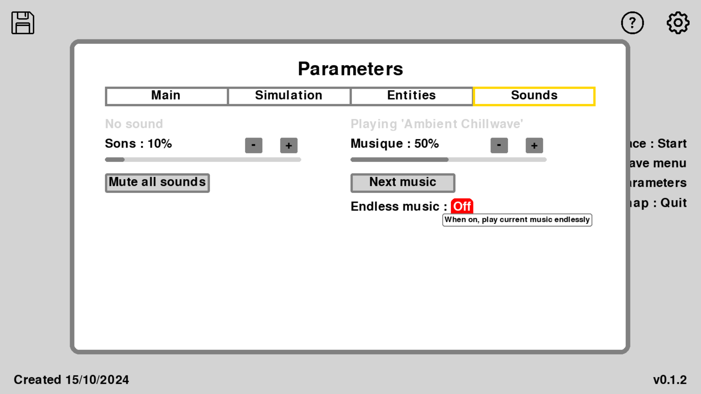
    Display last played sound and current music name in lightgrey.
    - "Sounds" : Sound volume.  Between 0 and 100.
    - "Mute all sounds" : Will restart the sound manager and stop all playing sound. Click on it if a sound problem occurs.
    - "Music" : Music volume. Between 0 and 100.
    - "Next music" : Will play another music. Choose randomly among musics/ file (3 choices by default, feel free to had whatever you want).
    - "Endless music" : Will play the current music endlessly.

Saves menu : 
- "Simulations" : Open the simulation tab.
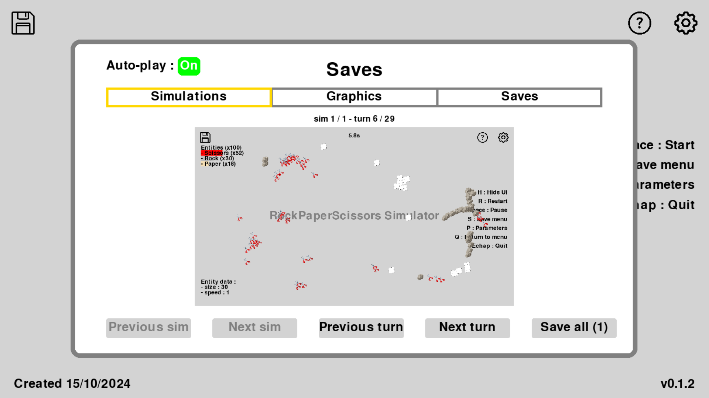
    Display the first turn of the first simulation if there is any. Show a transparent message if not.
    - "Previous sim" : Show the previous simulation if there is any.
    - "Next sim" : Show the next simulation if there is any.
    - "Previous turn" : Show the previous turn of the current simulation.
    - "Next turn" : Show the next turn of the current simulation.
    - "Save all (X)" : Save all simulations' images as gif and data in a save.

- "Graphics" : Open the graphic tab.
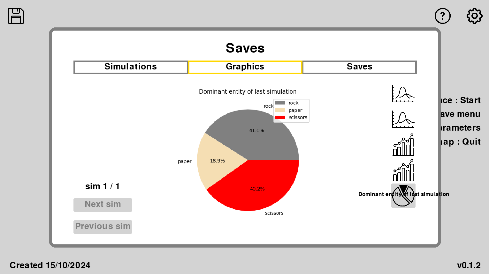
    Display the selected graphic if at least one simulation was launch. Show a transparent message if not.
    - "Number of entity every second" : Line plot graphic which show the amount of entity every second during the current simulation.
    - "Average options evolution" : Line plot graphic which show the average value of an option each turn.
      Will stay unchanged if the mutation setting is off (normally).
      Can select speed, range or size from the colored squares at the right of the graphic.
    - "Pinnacle of each entity" : Bar chart graphic which show what was the maximum number of entity in a population.
    - "Maximum for each option" : Bar chart graphic which show what was the maximum value of an option.
    - "Dominance of entities" : Pie chart graphic which show the proportion between each population at their pinnacle.
    - "Next sim" : Show the next simulation if there is any.
    - "Previous sim" : Show the previous simulation if there is any.

- "Saves" : [In construction] Open the save tab.
    Display all saves if there is any. Show a message if not.
    - "Save all" : Save all simulations launch today.
    - "Save current sim" : Save only the selected simulation.
    - "Delete today saves" : Delete all simulations launch today.
    - "Delete all" : Delete all saves (not recommended).

***
## Roadmap

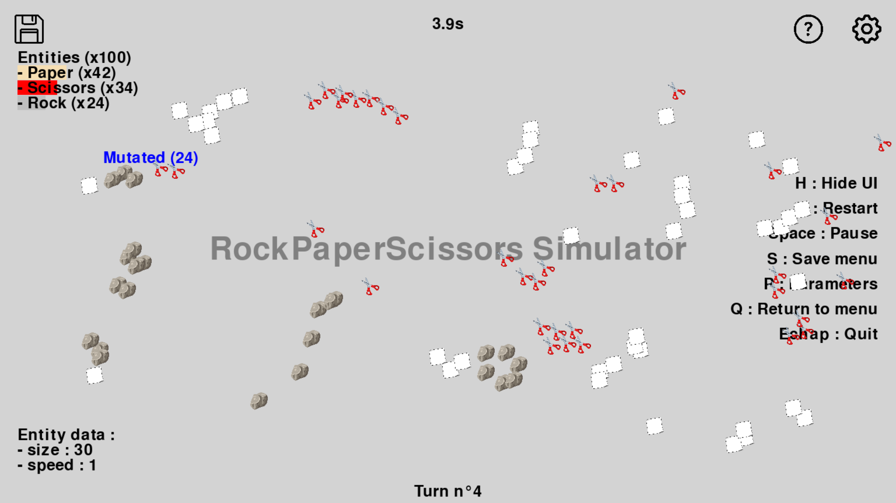

- v0.0.1 :
	- Basic functions
- v0.0.2 :
	- Create class for entities
- v0.0.3 :
	- Add fonts
 	- Add images
- v0.0.4 :
	- Test and adjust entities
- v0.0.5 :
	- Avoid entities to move away from the map (add map borders)
- v0.0.6 :
	- Display data on screen
 	- Add percent bg for nb entity (add percent & quantity)
- v0.0.7 :
	- Make simulation personalized in game (add parameters)
- v0.0.8 :
	- Add pause screen
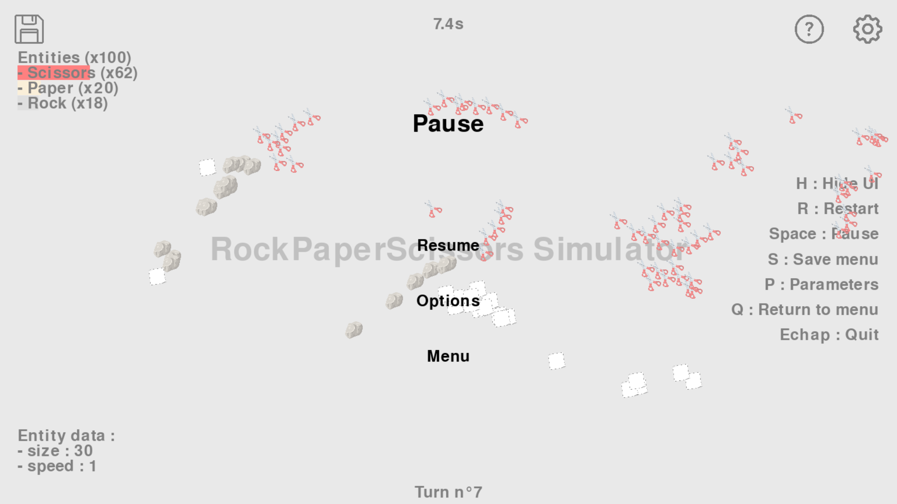
 	- Add key shortcuts
  	- Make entity with no target flee enemy (add smartness)
- v0.0.9 :
	- Add options on parameters' screen (map borders, inf map, smart, follow mouse, appear with click)
- v0.1.0 :
	- Add range for entity (detection for target and predator)
 	- Add overlay for entities (display most data)
- v0.1.1 :
	- Add menus
 	- End of simulation if only one type remaining (add auto_end parameter)
- v0.1.2 :
	- Add sounds (chill music)
 	- Add mutation option (can also change type randomly)
- v0.1.3 :
	- Add graphics : Adding graphics to help understand the simulation's evolution.
      Graphics are now saved when saving simulations.
	- Saves result : Create a save with most of the simulation data
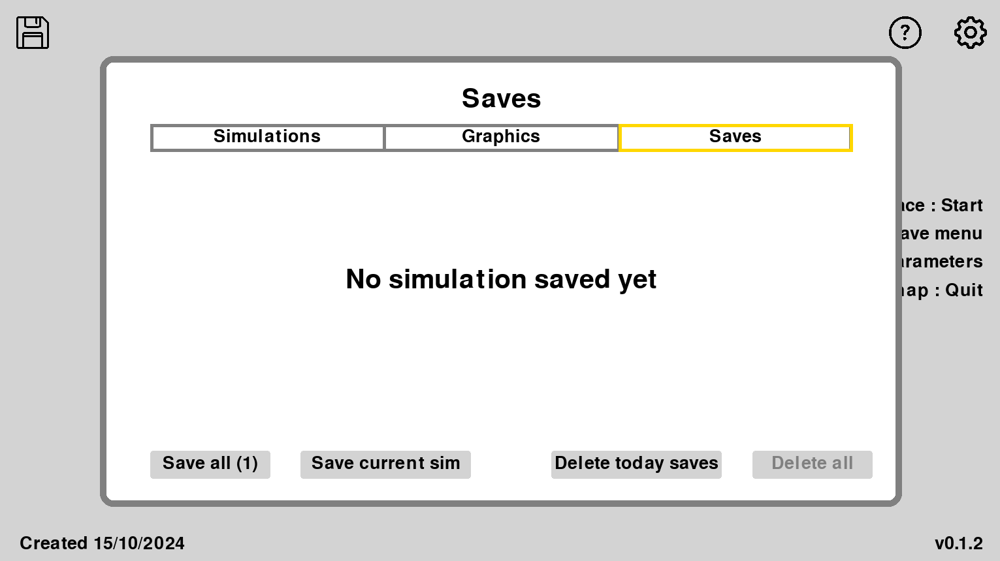
	- Create datamanager : Added a class specialized for above features.
	- Add save menu : Added a menu to display all saves and graphics.
	- Take screenshots each turn : To have a visual aspect of the evolution during the simulation.
      Added a tab in the save menu and changed the format of saved screenshots (png to gif: take less place)
- v0.1.4 :
	- Add possibility to add more entity type : Add the Sheldon rps with Spock and Lizard.
- v0.1.5 :  [Tutorials are skip for now]
	- Add tutorial : Add tutorial for first launch to teach user all features.
	- Add gamma : Make gamma work.
	- Finish other small tasks : Fix small details or bugs.
- v0.9.9 : [Later but partially exists]
	- Make documentations : Create a full documentation for the whole project.
	- Complete functions description : Add a commentary with the purpose, args description and args type of each function.
- v1.0.0 : [In production]
	- Make the code into a .exe : Will be easier to install and launch (hopefully python interpreter won't be needed anymore).

***
## User license : GNU GPL v3
- Copyleft strict
- You can use it, modify it and share it, but you have to keep the same license
- Must stay open source

***
**Contact : mir.nathan666@gmail.com**

Feel free to share your experience and your suggestions !
